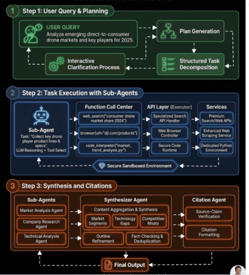

# Enterprise-Grade Multi-Agent CrewAI Architecture

This document defines the upgraded Market Research & Copywriting Crew as an enterprise-grade Multi-Agent System (MAS). It captures the system topology, state management protocol, data schema architecture, and automated quality-control loops needed before any code is written.

## 🏛️ Comprehensive Enterprise MAS Architecture

### Unified System Topology Diagram

The system is designed as a multi-node state machine with an independent Editor/Critic Node that creates a recursive quality loop.



*Figure: Runtime flow from Researcher → Writer → Editor/Critic, with rejected drafts looping back for revision.*

```text
                              ┌──────────────────────┐
                              │  Runtime Invocation  │
                              │   Inputs: {topic}    │
                              └───────────┬──────────┘
                                          │
                                          ▼
                    ┌───────────────────────────────────────────┐
                    │       NODE 1: RESEARCHER AGENT            │
                    │  Action: Tool-Based Grounding (Serper)    │
                    └─────────────────────┬─────────────────────┘
                                          │
                                          │ (State Payload: Research Brief)
                                          ▼
                    ┌───────────────────────────────────────────┐
                    │        NODE 2: WRITER AGENT               │
                    │  Action: Creative Transformation (No-Tool)│
                    └─────────────────────┬─────────────────────┘
                                          │
                                          │ (State Payload: Content Draft)
                                          ▼
                    ┌───────────────────────────────────────────┐
                    │        NODE 3: EDITOR / CRITIC            │◄────────────────┐
                    │  Action: Schema & Quality Evaluation      │                 │
                    └─────────────────────┬─────────────────────┘                 │
                                          │                                       │
                                          ├─ [Status: REJECTED] ──────────────────┘
                                          │  Payload: Feedback Logs & Revision Instructions
                                          │
                                          └─ [Status: APPROVED]
                                          │
                                          ▼
                               ┌──────────────────────┐
                               │  Persistence Engine   │
                               │  File: final_output.md │
                               └──────────────────────┘
```

### Framework Synchronization

- Orchestration Layer: CrewAI Engine
- Execution Model: Deterministic MAS pipeline with feedback gating
- State Management: Strongly typed payload forwarding between nodes with explicit evaluation status
- Quality Control: Automated Editor/Critic Node gating that can trigger a revision cycle back to the Writer

## 🎛️ Multi-Agent System Core Architecture Matrix

| Node Name | Computational Core (LLM) | System Tooling Access | State Dependency | Operational Mandate | Boundary Controls |
|---|---|---|---|---|---|
| Researcher Agent | `gpt-4o` | `SerperDevTool` (Google Search API) | External User Parameter (`{topic}`) | Scrape, parse, and structure the top 3 verifiable industry breakthroughs | `allow_delegation=False`; strict token constraint via max search results |
| Writer Agent | `gpt-4o-mini` | None (`Sandboxed`) | Output payload from Researcher Node | Transform raw text briefs into clean, professional Markdown copy | `allow_delegation=False`; zero network access to block factual hallucinations |
| Editor / Critic | `gpt-4o` | None (`Sandboxed`) | Output payload from Writer Node | Evaluate written assets against compliance, formatting, and structural criteria | Can trigger recursive return route to Writer for corrections |

## 🧱 Data Schema Architecture (JSON Inter-Agent Payloads)

Strict inter-agent schemas ensure payloads are machine-readable and context-preserving.

### State 1: Research Brief Payload Schema (Researcher → Writer)

```json
{
  "timestamp": "2026-05-29T06:28:00Z",
  "topic": "string",
  "source_grounding": [
    {
      "source_url": "string",
      "extracted_fact": "string",
      "metric_data": "string"
    }
  ],
  "core_breakthroughs": [
    {
      "title": "string",
      "technical_summary": "string"
    }
  ]
}
```

### State 2: Content Evaluation Schema (Editor → System Control)

```json
{
  "evaluation_status": "APPROVED | REJECTED",
  "score_metrics": {
    "factual_alignment_score": "float (0.0 - 1.0)",
    "formatting_compliance": "boolean"
  },
  "feedback_logs": "string (Empty if APPROVED, contains actionable revision goals if REJECTED)"
}
```

## 🔄 Detailed Control Flow & Execution Protocol

1. Initialization:
   - The user submits a raw text topic via the execution engine.

2. Grounding Phase (Node 1):
   - The Researcher polls external search endpoints.
   - It filters out marketing filler and structures the data into the Research Brief Payload Schema.
   - The output is an explicit, grounded research brief.

3. Synthesis Phase (Node 2):
   - The Writer consumes the brief.
   - It generates a markdown draft that follows the facts in the payload strictly.

4. Evaluation Loop (Node 3):
   - The Editor evaluates the draft against the source grounding payload.
   - If the draft fails compliance or adds outside information, the Editor returns status `REJECTED` and emits feedback logs.
   - The workflow loops back to Node 2 with the revision instructions.
   - If the draft passes, the Editor returns status `APPROVED`.

5. Persistence Phase:
   - Once approved, the system performs an atomic file write to `final_output.md`.
   - Existing output state is overwritten to ensure a single clean final result.

## 🛡️ Enterprise-Grade State Management Protocol

- Payloads are immutable between node transitions.
- The Writer only consumes one explicit schema type; it cannot access raw search tool output directly.
- The Editor only consumes the completed draft and the original research grounding schema for verification.
- This enforces a clean separation of concerns and prevents cross-node contamination.

## 🧪 Automated Quality-Control Loop

- The Editor/Critic Node is the only gatekeeper that can trigger a revision cycle.
- Feedback logs are explicit and actionable, containing:
  - missing factual items,
  - structure or format violations,
  - unsupported claims or hallucinations.
- The loop is limited by a configurable retry policy to avoid endless rewrite cycles.

## 📌 System Topology Summary

This design upgrades the system from a linear two-agent script into a resilient MAS with:
- a grounded research source node,
- a deterministic writer node,
- an independent quality control node,
- explicit schema-driven state handoff,
- and an atomic persistence endpoint.

`ARCHITECTURE.md` now captures the enterprise-grade design needed before any implementation begins.