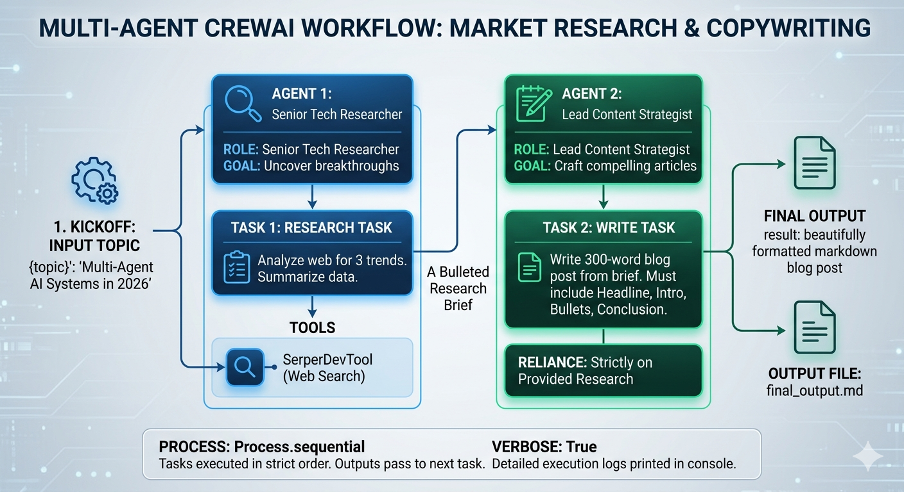

# Multi-Agent Market Research & Copywriting Crew

An autonomous multi-agent workflow built with [CrewAI](https://crewai.com) that orchestrates a team of specialized AI agents to conduct web research and generate structured, markdown-formatted blog content.

Learn more about the technical workflow design in [`ARCHITECTURE.md`](ARCHITECTURE.md).



## 🚀 Overview

This architecture avoids the common pitfalls of single-prompt AI systems (such as hallucinations and loss of focus) by splitting the operational logic into two distinct steps:
1. **Information Gathering:** A dedicated Research Agent searches the live web for verified facts.
2. **Content Synthesis:** A dedicated Writing Agent processes the research brief without web access, ensuring high fidelity to the source data.

## 🛠️ Prerequisites & Installation

### 1. Clone or Set Up Your Project Directory
Create a new directory and navigate into it:
```bash
mkdir multi-agent-crew && cd multi-agent-crew
```

### 2. Install Dependencies
Install the required CrewAI core, tools, and LLM orchestration packages:
```bash
pip install crewai crewai-tools langchain-openai
```

### 3. Configure Environment Variables
You need API credentials from OpenAI and Serper (for web search access). Set them up in your terminal environment:

**On Linux/macOS:**
```bash
export OPENAI_API_KEY="your-openai-api-key"
export SERPER_API_KEY="your-serper-api-key"
```

**On Windows (Command Prompt):**
```cmd
set OPENAI_API_KEY=your-openai-api-key
set SERPER_API_KEY=your-serper-api-key
```

**On Windows (PowerShell):**
```powershell
$env:OPENAI_API_KEY="your-openai-api-key"
$env:SERPER_API_KEY="your-serper-api-key"
```

## 💻 Usage

1. Create a script named `main.py` and paste the provided workflow code into it.
2. Run the script:
```bash
python main.py
```

Upon execution, the terminal will output the real-time thought loops, tool interactions, and handoffs between your agents (`verbose=True`).

## 📁 Output Structure

The workflow automatically creates and updates files locally. Your directory structure will update as follows:

```text
multi-agent-crew/
├── main.py            # Workflow definition script
├── README.md          # Documentation file
└── final_output.md    # Generated markdown content (Created post-run)
```

## 🎛️ Customization

To change the research subject, simply update the `inputs` dictionary at the bottom of `main.py`:

```python
result = tech_crew.kickoff(inputs={"topic": "Your Custom Tech Topic Here"})
```

